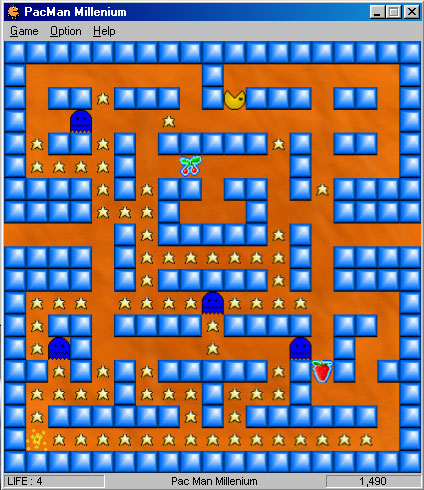



## Pac\-Man Millenium \- Pacman clone, with fully working gameplay, AI and DirectX\. \*Editted\*

### Description

Fully working and playable PacMan clone, with better AI and GamePlay. Made by using DirectX 7 (DirectDraw), feature include Level Editor.

Note: Some of the graphic were taken from other sources. I take no credit for that as this is about this source code is all about the code, not the graphic. Should the respective owners require acknowledgement, please do not hesitate to contact me on jsalim@dingoblue.net.au, or ICQ #18495651

And also your comment and rating is greatly appreciated. Thanks.
 
### More Info
 

             |
---                |---
**Submitted On**   |2000-10-14 19:13:32
**By**             |[James Salim](https://github.com/Planet-Source-Code/PSCIndex/blob/master/ByAuthor/james-salim.md)
**Level**          |Intermediate
**User Rating**    |4.9 (59 globes from 12 users)
**Compatibility**  |VB 6\.0
**Category**       |[Games](https://github.com/Planet-Source-Code/PSCIndex/blob/master/ByCategory/games__1-38.md)
**World**          |[Visual Basic](https://github.com/Planet-Source-Code/PSCIndex/blob/master/ByWorld/visual-basic.md)
**Archive File**   |[CODE\_UPLOAD1064710142000\.zip](https://github.com/Planet-Source-Code/james-salim-pac-man-millenium-pacman-clone-with-fully-working-gameplay-ai-and-directx-edit__1-12033/archive/master.zip)

